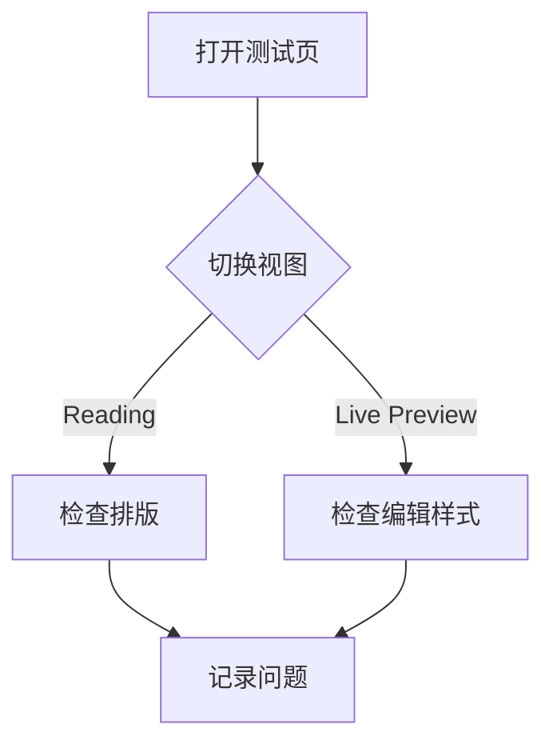
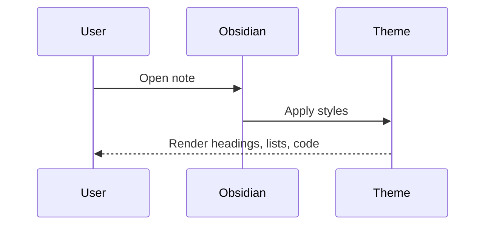
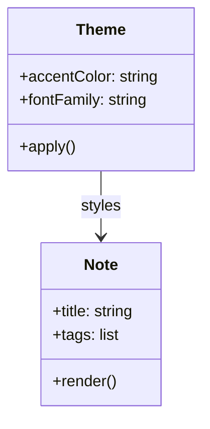

---
aliases:
  - 主题体检页
  - Theme QA
tags:
  - obsidian
  - markdown
  - theme-test
cssclasses:
  - theme-test-note
publish: false
rating: 4.5
reviewed: true
created: 2026-03-10
updated: 2026-03-10T21:30:00
source: https://help.obsidian.md/syntax
related:
  - "[[AI]]"
  - "[[Todo today]]"
display_name: Obsidian Theme 全语法样式测试
---

%% 这是一段只在编辑模式可见的块注释，用来测试注释的隐藏效果。 %%

# Obsidian Theme 全语法样式测试

这是一份尽量覆盖官方 Obsidian Markdown 语法、常见阅读样式、嵌入效果与边界情况的单页测试文档。

建议依次检查：

- 阅读视图
- Live Preview
- Source mode
- 浅色和深色模式
- 桌面端与移动端

> [!note] 使用方法
> 把这份笔记单独打开，然后从上到下滚动。留意标题层级、段落间距、列表缩进、代码高亮、表格边框、图片圆角、callout 配色、脚注、数学公式、Mermaid 图和折叠块是否协调。

## 目录

- [[#Properties 与元数据]]
- [[#标题与段落]]
- [[#行内样式]]
- [[#列表与任务]]
- [[#引用与 Callouts]]
- [[#链接与嵌入]]
- [[#表格]]
- [[#代码块]]
- [[#脚注与注释]]
- [[#数学公式]]
- [[#Mermaid]]
- [[#HTML 片段]]
- [[#标签、分隔线与边界情况]]
- [[#主题检查清单]]
- [[#嵌入目标]]

## Properties 与元数据

这份笔记顶部的 properties 用来测试这些类型是否显示正常：

- `List`: `aliases`、`tags`、`cssclasses`、`related`
- `Checkbox`: `publish`、`reviewed`
- `Number`: `rating`
- `Date`: `created`
- `Date & time`: `updated`
- `Text`: `display_name`、`source`

这行里有一个 %%inline comment%% 行内注释，阅读视图里不应该显示。

## 标题与段落

## 二级标题

### 三级标题

#### 四级标题

##### 五级标题

###### 六级标题

这是一个普通段落，用来观察主题的默认正文宽度、行高、中文字体、英文回退字体，以及中英文混排时的节奏感。

这一行的末尾有两个空格。  
所以这里应该是同一段里的强制换行，而不是新段落。

这是一个新段落。请观察段前距、段后距、首尾空白和可读宽度。A quick brown fox jumps over the lazy dog. 数字 0123456789，字母 O0o，I1l，常常最能暴露字体选择问题。

如果你想测试额外空格，可以看这里：前面是 `A&nbsp;&nbsp;B` 的效果。A&nbsp;&nbsp;B

## 行内样式

普通文本

*斜体文本* 和 _另一种斜体写法_

**粗体文本** 和 __另一种粗体写法__

***粗斜体*** 和 ___另一种粗斜体写法___

~~删除线~~

==高亮==

`inline code`

``code with a backtick ` inside``

下标：H~2~O

上标：x^2^

混合样式示例：**粗体**、*斜体*、==高亮==、~~删除线~~、`代码`、H~2~O、x^2^、[Obsidian Help](https://help.obsidian.md)。

转义测试：

- \*这段不应该变成斜体\*
- \`这段不应该变成行内代码\`
- \[\[这段不应该变成双链\]\]
- \#这段不应该变成标签
- 1\. 这行不应该变成有序列表
- \| 这个竖线在表格里尤其重要

## 列表与任务

### 无序列表

- 第一项
- 第二项
  - 二级列表
  - 二级列表里的 **粗体**
    - 三级列表
- 第三项

### 有序列表

1. 起床
2. 喝咖啡
3. 打开 Obsidian
   1. 看日报
   2. 记笔记
4. 收工

### 混合列表

1. 今天的主题检查
   - 标题是否够清晰
   - 留白是否均衡
2. 明天可以继续优化
   - 引用
   - 代码块
   - 表格

### 任务列表

- [ ] 未完成任务
- [x] 已完成任务
- [?] 使用问号也会被视为已完成
- [-] 使用短横线也会被视为已完成
- [ ] 包含 **粗体**、`代码` 和 [链接](https://obsidian.md)
- [ ] 这是一个很长很长的任务项，用来测试复选框与多行文本对齐是否舒服，尤其适合检查移动端、窄窗口和较大字号下的缩进、换行与行高表现。
  - [ ] 嵌套子任务一
  - [x] 嵌套子任务二

## 引用与 Callouts

> 这是一个普通引用块。
>
> 第二段引用文字，用来观察引用左边框、缩进、字号和颜色。
>
>> 这是嵌套引用。

> [!note] Note
> 这是最基础的 note callout。

> [!abstract] Abstract
> 用来测试 abstract 样式。

> [!info] Info
> 用来测试 info 样式。

> [!todo] Todo
> 适合看待办类提示的视觉样式。

> [!tip] Tip
> 小提示类内容。

> [!success] Success
> 成功态通常会有较明显的颜色差异。

> [!question] Question
> 适合看问答类视觉层级。

> [!warning] Warning
> 适合看警告态是否足够醒目。

> [!failure] Failure
> 适合看失败态与 danger 的区别。

> [!danger] Danger
> 适合看高风险提示的视觉强度。

> [!bug] Bug
> 适合看 issue 或 bug 记录的样式。

> [!example] Example
> 适合看示例块的排版。

> [!quote] Quote
> “写作不是记录答案，而是逼近问题。”

> [!tip]- 默认折叠
> 这块默认应该是折叠状态。

> [!example]+ 默认展开
> 这块默认应该是展开状态。

> [!tip] 只有标题的 callout

> [!warning] 嵌套内容
> 这个 callout 里故意放一些复杂元素：
>
> - 列表一
> - 列表二
>
> ```js
> const theme = "obsidian";
> console.log(theme);
> ```
>
> 以及一个链接：[官方文档](https://help.obsidian.md)

> [!question] 多层嵌套
> 这是第一层。
>
> > [!todo] 第二层
> > 这里是嵌套 callout。
> >
> > > [!example] 第三层
> > > 用来测试更深层级的边框、缩进和圆角。

> [!custom-question-type] 自定义类型
> 如果你的主题或 CSS snippet 定义了自定义 callout，这里应该显示自定义样式；否则会回退到 note 的默认样式。

## 链接与嵌入

### 内部链接

- `Wikilink`: [[AI]]
- `Wikilink + alias`: [[Todo today|今日待办]]
- `同页标题链接`: [[#Mermaid]]
- `同页块链接`: [[#^theme-anchor]]
- `Markdown 内链`: [Todo today](Todo%20today.md)
- `Markdown 内链（无扩展名）`: [AI](AI)

### 外部链接

- [Obsidian 官网](https://obsidian.md)
- [Obsidian Help](https://help.obsidian.md)
- [Obsidian URI](obsidian://open?vault=jhobsidian&file=AI.md)

### 故意保留的异常链接

- [[这是一条故意不存在的笔记]]
- ![[这是一条故意不存在的嵌入]]

### 图片与嵌入

本地图像嵌入：

![[Pasted image 20260302120921.png|240]]

同页标题嵌入：

![[#嵌入目标]]

同页块嵌入：

![[#^theme-anchor]]

媒体占位语法示例：

```md
![[sample.pdf]]
![[sample.mp3]]
![[sample.mp4]]
```

## 表格

### 基础表格

| 语法     | 示例         | 说明              |
| -------- | ------------ | ----------------- |
| 粗体     | `**bold**`   | 强调              |
| 高亮     | `==mark==`   | Obsidian 扩展语法 |
| 双链     | `[[AI]]`     | Vault 内部链接    |
| 行内代码 | `` `code` `` | 等宽字体          |

### 对齐测试

| 左对齐       |  居中  | 右对齐 |
| :----------- | :----: | -----: |
| 苹果         |  香蕉  |     10 |
| Cat          |  Dog   |    200 |
| 长一点的文本 | 中间列 |   3000 |

### 表格中的复杂内容

| 类型     | 内容                                        | 观察点               |
| -------- | ------------------------------------------- | -------------------- |
| 别名链接 | [[Obsidian Theme 全语法样式测试\|当前笔记]] | 需要对 `\|` 转义     |
| 图片     | ![[Pasted image 20260302120921.png\|80]]    | 图片缩放、边框、对齐 |
| 行内代码 | `const x = 1`                               | 字重与背景           |

## 代码块

行内代码已经在上面展示，这里测试块级代码、语法高亮和横向滚动。

```python
from dataclasses import dataclass

@dataclass
class ThemeCheck:
    mode: str
    passed: bool

checks = [
    ThemeCheck(mode="reading", passed=True),
    ThemeCheck(mode="live-preview", passed=False),
]

for check in checks:
    print(check)
```

~~~css
:root {
  --theme-accent: #2f6fed;
  --theme-radius: 14px;
  --theme-shadow: 0 10px 30px rgb(0 0 0 / 0.12);
}

.markdown-preview-view img {
  border-radius: var(--theme-radius);
}
~~~

````markdown
```js
console.log("这里用四个反引号包裹，测试代码块里再出现代码块");
```
````

    这是一个通过缩进产生的代码块。
    它通常没有语言高亮，但会保留等宽字体和缩进。

超长行滚动测试：

```ts
const longLine = "theme-check-theme-check-theme-check-theme-check-theme-check-theme-check-theme-check-theme-check-theme-check-theme-check";
```

## 脚注与注释

脚注示例一：主题不仅要“好看”，还要“可读”[^readability]。

脚注示例二：命名脚注通常更容易维护[^named-footnote]。

脚注示例三：多行脚注适合测试缩进、行距和返回链接位置[^multi-line-note]。

行内脚注只在阅读视图中可见。^[这是一条行内脚注。]

注释示例：

- 这句里有一个 %%编辑模式可见，阅读模式不可见%% 注释。
- 下方还有一段块注释。

%%
这是一段多行块注释。
它应该只在编辑模式中出现。
%%

## 数学公式

行内公式：$E = mc^2$

块级公式：

$$
\int_0^1 x^2 \, dx = \frac{1}{3}
$$

矩阵：

$$
\begin{bmatrix}
1 & 2 \\
3 & 4
\end{bmatrix}
$$

分段函数：

$$
f(x) =
\begin{cases}
x^2, & x \ge 0 \\
-x, & x < 0
\end{cases}
$$

## Mermaid







## HTML 片段

<kbd>Ctrl</kbd> + <kbd>P</kbd> 应该看起来像快捷键。

<mark>这是 HTML 的高亮效果。</mark>

<abbr title="HyperText Markup Language">HTML</abbr> 缩写提示测试。

<progress value="65" max="100"></progress>

<details>
  <summary>点击展开 details / summary 测试</summary>
  <p>这里故意放一小段内容，看看折叠控件、边距和字体是否自然。</p>
</details>

<div>
  这是一个原生 HTML 块。通常 Markdown 在原生 HTML 容器里的处理方式会和普通段落略有不同。
</div>

<div>
这里的 **粗体**、`代码` 和 [[AI]] 根据官方的 Obsidian Flavored Markdown 说明，不应该在 HTML 容器里被解析成 Markdown。
</div>

## 标签、分隔线与边界情况

内联标签：#obsidian #theme/test #markdown/demo

分隔线一：

---

分隔线二：

***

分隔线三：

___

阅读压力测试段落：

在一篇真实笔记里，你往往不会只看到单一语法，而是会看到 **粗体**、*斜体*、==高亮==、`代码`、[外链](https://help.obsidian.md)、[[AI|内部链接]]、脚注[^readability]、标签 #writing 与数学 $a^2+b^2=c^2$ 混在一起。一个成熟的主题应该能让这些元素彼此区分，但又不至于互相抢戏。

## 主题检查清单

| 检查项         | 你需要关注什么                               |
| -------------- | -------------------------------------------- |
| 标题层级       | 字号、字重、上下间距是否清晰                 |
| 正文排版       | 行高、行宽、段间距是否舒服                   |
| 列表与任务     | 缩进、符号对齐、多行换行是否自然             |
| Callouts       | 图标、边框、背景色、标题权重是否统一         |
| 代码块         | 等宽字体、语法高亮、滚动条、背景是否协调     |
| 表格           | 边框、斑马纹、padding、图片/代码混排是否稳定 |
| 链接与嵌入     | 正常链接、坏链接、预览和嵌入状态是否可区分   |
| 数学与 Mermaid | 是否溢出、字号是否合适、颜色是否过重         |
| HTML 元素      | `kbd`、`details`、`progress` 是否被主题误伤  |
| 移动端         | 窄屏下是否仍然可读                           |

## 嵌入目标

这个小节专门给上面的“同页标题嵌入”使用，内容尽量简短，便于观察嵌入卡片的边距、背景和引用边框。

> [!quote] 小段内容
> 记笔记不是为了囤积信息，而是为了让思考可以被再次进入。

这是一段可被块引用的文本。它同时包含 **粗体**、`代码` 和 [链接](https://obsidian.md)。 ^theme-anchor

[^readability]: 如果主题很好看，但长文读十分钟就累，那它依然不算一个好主题。
[^named-footnote]: 命名脚注最终仍然会显示为编号，但在源码里更容易维护和复用。
[^multi-line-note]: 这是多行脚注的第一行。
  这是同一个脚注的第二行，前面需要保留两个空格缩进。
  这一行继续测试脚注区块的边距、行高和换行表现。
